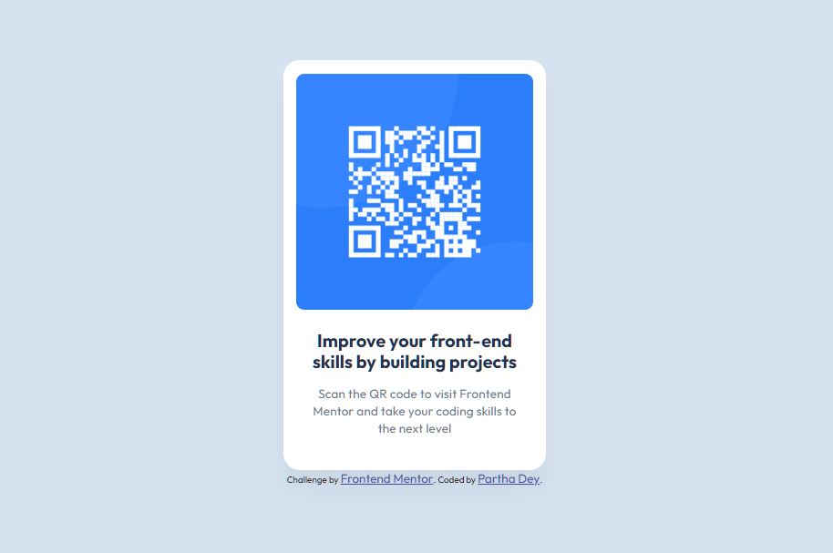

Here’s a well-structured **README** file for your project based on the details you provided:

---

# **Frontend Mentor - QR Code Component Solution**

This is my solution for the **Frontend Mentor QR Code Component challenge**. The goal was to **replicate the given design** while ensuring responsiveness and clean code structure using **HTML and CSS**.

## **Overview**
This project is a simple **QR code card component**, designed to help improve front-end skills by working with **layout, styling, and responsive design** techniques.

### **Screenshot**
```

```

### **Links**
- **GitHub Repo Link:** [https://github.com/ParthaDey5/qr-code-project](https://github.com/ParthaDey5/qr-code-project)

- **Live Site URL:** [https://ParthaDey5.github.io/qr-code-project/
](https://ParthaDey5.github.io/qr-code-project/
)

---

## **Built With**
- **HTML5** – Semantic markup for structured content.
- **CSS** – Custom styling, responsive design.
- **Flexbox** – Used for layout positioning.
- **Google Fonts** – Integrated for typography styling.
- **CSS Box Shadow** – Applied for subtle visual depth.
- **Media Queries** – Ensured responsiveness for different screen sizes.

---

## **Challenges & Learnings**
During this project, I focused on:
- Implementing **Flexbox for centering elements**.
- Using **CSS properties effectively**, including shadows and responsive units.
- Handling **Google Fonts** efficiently for better typography.
- Structuring **semantic HTML** to ensure clean and maintainable code.

---

## **Future Improvements**
Here are some enhancements I’d like to explore:
- **Adding hover effects** to improve UI interactions.
- **CSS animations** to make the QR code fade in smoothly.
- **Exploring JavaScript** for dynamic behaviors (like copying the QR code link).
- Making the design **more accessible** by improving contrast and ARIA attributes.

---

## **How to Run the Project**
1. **Clone this repository**:
   ```bash
   git clone [https://github.com/ParthaDey5/qr-code-project]
   ```
2. Open `index.html` in a browser.

---

## **Acknowledgments**
Big thanks to **Frontend Mentor** for providing this challenge. This project helped strengthen my front-end skills while working with **HTML & CSS fundamentals**.

---


